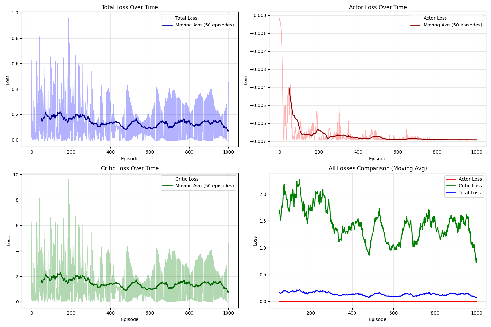
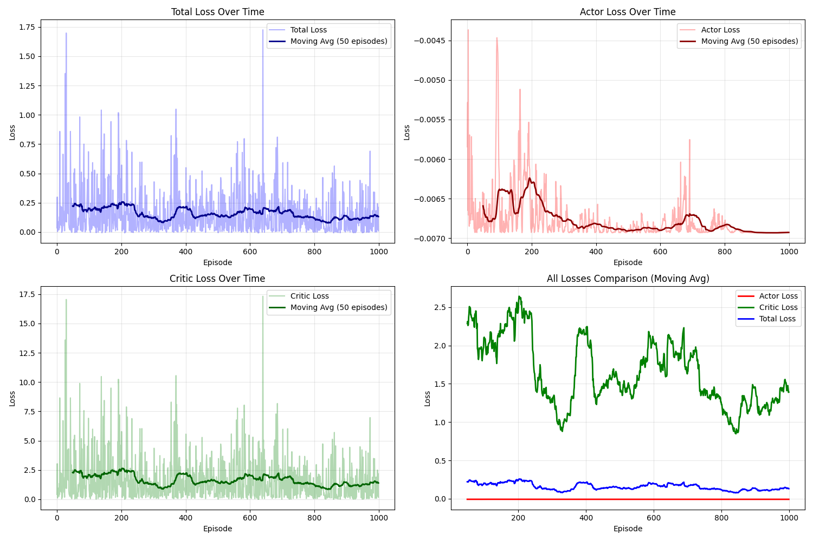

# Deep Reinforcement Learning for Card Game AI

A two-player card game implementation using Actor-Critic reinforcement learning, with experimental LLM-based reward shaping.

## 🎮 Game Overview

This is a strategic two-player card game where the objective is to achieve the **lowest total points** by the end of the game. Players manage hidden cards, use special card powers, and decide when to end the game by calling "Show."

### Key Game Mechanics:
- **54 cards**: Standard deck (52 cards) + 2 Jokers
- **Each player**: Receives 2 cards face-down
- **Goal**: Minimize your total points
- **Special cards**: 10s (peek own card), Jacks (peek opponent's card), Queens/Kings (card swaps - currently disabled)

For complete rules, see [GAME_RULES.txt](GAME_RULES.txt)

---

## 🧠 Training Approaches

We trained two models to compare different learning paradigms:

### 1. Pure Deep RL (Baseline)
- **Method**: Actor-Critic with only terminal rewards (+1 for win, -1 for loss, 0 for tie)
- **Training**: 1000 episodes
- **Reward Signal**: Sparse - only at game end

### 2. LLM-Assisted RL (Experimental)
- **Method**: Actor-Critic with intrinsic LLM rewards + terminal rewards
- **LLM**: GPT-4o-mini provides action quality feedback
- **Reward Combination**: Proper discounted returns (Bellman backup)
- **Training**: 1000 episodes

---

## 📊 Results

### Pure Deep RL Training


**Characteristics:**
- Clean convergence
- Stable actor and critic losses
- Efficient learning from game outcomes only
- Low variance after 200 episodes

### LLM-Assisted RL Training


**Characteristics:**
- Higher variance in losses
- LLM rewards introduce noise
- More exploration but less stability
- Convergence is less smooth

---

## 🏆 Winner: Pure Deep RL

**The pure Deep RL model outperforms the LLM-assisted model.**

### Why Pure RL Works Better:

1. **Cleaner Signal**: Terminal rewards provide clear, unambiguous feedback
2. **Lower Variance**: No noise from LLM interpretations
3. **Faster Convergence**: Direct optimization toward winning
4. **Computational Efficiency**: No API calls, faster training
5. **Robustness**: Not dependent on LLM prompt engineering

### Why LLM-Assistance Struggled:

1. **Reward Misalignment**: LLM's notion of "good play" may not align with winning
2. **Noise Introduction**: Natural language reasoning adds variance
3. **Prompt Sensitivity**: Results heavily depend on prompt quality
4. **Credit Assignment**: Hard to separate LLM advice from actual outcomes
5. **Cost**: API calls add latency and expense

---

## 🚀 Usage

### Training a Model

**Train with Pure RL (Recommended):**
```bash
python3 main.py --noLLM
```

**Train with LLM Assistance:**
```bash
python3 main.py
```

### Fighting Two Models

Compare two trained models by making them play against each other:

```bash
python3 fight.py --model1 model_final_pureDL.pth --model2 model_final_withLLM.pth --games 100
```

Results are saved to `fight_results.txt`.

---

## 📁 Project Structure

```
.
├── main.py                          # Training script
├── fight.py                         # Model evaluation/comparison
├── gameEngine.py                    # Human playable game
├── gameEngineForRLTraining.py      # RL training game loop
├── actorcritic.py                   # Actor-Critic neural network
├── helpers.py                       # Game logic and utilities
├── cardsNpoints.py                  # Card definitions and points
├── llm.py                           # LLM reward model (experimental)
├── GAME_RULES.md                    # Complete game rules
├── model_final_pureDL.pth          # Trained pure RL model
├── model_final_withLLM.pth         # Trained LLM-assisted model
└── requirements.txt                 # Python dependencies
```

---

## 🔧 Installation

```bash
# Clone the repository
git clone <your-repo-url>
cd <folder name>

# Create virtual environment
python3 -m venv venv
source venv/bin/activate  # On Windows: venv\Scripts\activate

# Install dependencies
pip install -r requirements.txt
```

---

## 📦 Requirements

- Python 3.8+
- PyTorch
- OpenAI API (only for LLM-assisted training)
- Matplotlib
- python-dotenv

---

## 🎯 Key Hyperparameters

```python
episodes = 1000           # Training episodes
learning_rate = 0.001     # Adam optimizer
gamma = 0.99              # Discount factor
entropy_coef = 0.01       # Entropy regularization
```

---

## 📈 Training Details

### Pure RL Training Process:
1. Agent plays against a frozen copy of itself
2. Actions stored with log probabilities and state values
3. Terminal reward assigned based on winner
4. Actor-Critic update with advantage estimation
5. Opponent updated every 100 episodes

### LLM-Assisted Training Process:
1. Same as pure RL, plus:
2. LLM evaluates each action given game state
3. Intrinsic rewards combined with terminal reward
4. Proper discounted returns computed via Bellman backup
5. More costly and slower training

---

## 🎲 Play the Game

To play against the AI or human vs human:

```bash
python3 gameEngine.py
```

---

## 🔬 Conclusion

This project demonstrates that **well-designed reinforcement learning** can outperform LLM-assisted approaches for strategic games. The key insight: **simple, clear reward signals** lead to better learning than complex, noisy guidance from language models.

The pure RL model learned optimal strategies through self-play and sparse terminal rewards, proving that traditional RL methods remain highly effective for well-defined game environments.

---

## 📝 Future Work

- Implement Queen and King special powers
- Try different LLM prompting strategies
- Explore hybrid approaches with better reward normalization
- Test against human players
- Extend to multi-player scenarios

---

## 📄 License

MIT License

---

## 👤 Author

Khabbab Zakaria


